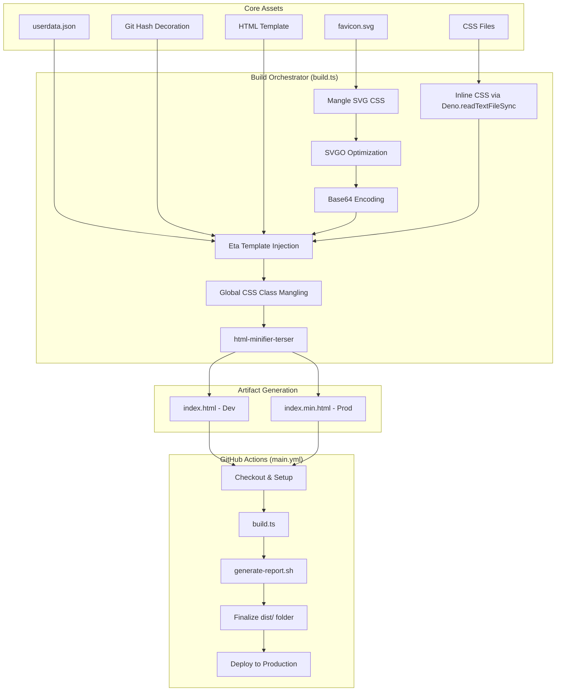
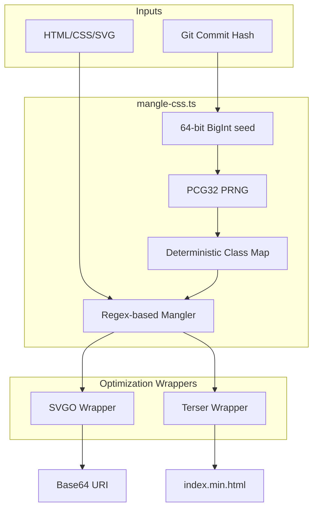

# sethdegay.dev

This project is a sandbox for minimizing webpage payload.

## Objectives

- Ensure payload size is under 14kb (excl. remote assets) to avoid additional
  round trips to the server.
  - Reference:
    [Why your website should be under 14kB in size](https://endtimes.dev/why-your-website-should-be-under-14kb-in-size/).
- Progressive enhancement approach to maintain functionality for security and
  performance conscious visitors who disable JavaScript on their browsers.
- Terminal-inspired/Brutalist aesthetic.

## Build Pipeline

### Core Assets Breakdown

| Asset              | Purpose                                                                          |
| ------------------ | -------------------------------------------------------------------------------- |
| data/userdata.json | Centralized store for site content (e.g. bio, projects, metadata).               |
| src/favicon.svg    | Adaptive SVG utilizing media queries for system-level light/dark mode support.   |
| src/index.eta      | Base Eta HTML template where source assets will be merged into.                  |
| src/main.css       | The main stylesheet which contains all styles, layouts, etc.                     |
| src/theme.css      | CSS tricks for initial theme and light/dark theme toggle                         |
| Latest Git Hash    | Used as a seed for the PRNG to ensure deterministic builds and footer decoration |

### Build Scripts Breakdown

| Script                     | Purpose                | Implementation Details                                                                                                                    |
| -------------------------- | ---------------------- | ----------------------------------------------------------------------------------------------------------------------------------------- |
| scripts/mangle-css.ts      | CSS class name mangler | Regex-based, uses [Deno @std/random](https://docs.deno.com/runtime/reference/std/random/) as a PRNG to generate deterministic class maps. |
| scripts/minify-html.ts     | HTML minifier          | Wrapper for `html-minifier-terser` configured for aggressive whitespace, comment, and redundant attribute removal.                        |
| scripts/optimize-svg.ts    | SVG optimizer          | `SVGO` wrapper utilizing default presets while preserving inline styles from upstream processing; outputs Base64 URIs.                    |
| scripts/template-engine.ts | Templating engine      | `Eta` wrapper configured with custom tags                                                                                                 |

### CSS Class Name Mangling

The PCG32 algorithm was selected for its native availability in the Deno
Standard Library, providing sufficient entropy to produce shuffled character
sets while maintaining a minimal footprint.

For compatibility with the Deno API, the latest git commit hash is converted
into a 64-bit BigInt seed. The conversion function within the script is written
to take any given string and hash it using SHA-256 to produce a uniform
distribution of bits. The resulting 32-byte buffer is truncated by taking the
first 8 bytes and parsing it to a 64-bit BigInt. This truncation provides a
64-bit numerical seed that is resistant to collision and remains consistent for
any given string.

The mangler operates in two distinct phases: Collection and Substitution. First,
the script scans the given assets to identify all CSS class names, mapping each
to a unique identifier from a shuffled character set ($a-z, A-Z$). This charset
is randomized using the deterministic PCG32 seed to ensure consistency across
builds. Once the map is established, it's now simply a task of substituting
matches to produce a minified output.

Finally, CSS class name mangling is executed prior to the optimization wrappers,
to ensure the integrity of the asset structure before it is exposed to external
libraries. This sequence allows the mangler to handle the original mapping while
the wrappers focus purely on final payload compression and syntax cleanup
preventing misinterpretation or unpredictably altering the structure.

### Favicon Optimization Strategy

Integrating the favicon as a Base64 URI directly supports the 14kb TCP Fast
Start objective by eliminating the overhead of an additional HTTP request. By
processing the SVG independently before injection, the build system mangles its
internal CSS classes against a separate class map from the global css class map
to maximize compression. Despite this separate optimization stage, the process
remains deterministic by utilizing the same git commit hash seed, ensuring
deterministic builds across environments.

#### Trade-offs

While embedding the favicon prevents the browser from caching it as a standalone
asset, this trade-off is negligible given the sub-14kb total payload. The entire
site is cached as a single unit, and the elimination of the additional HTTP
request round-trip outweighs the benefits of independent asset caching for a
project of this scale.

### Template Engine

The project utilizes Eta as the core templating engine to decouple site data
from source code. This replaces a legacy workflow that relied on hardcoded
values and sed injections. By centralizing logic within a unified render
function, the build process now consistently handles dynamic content including
bios, project metadata, and CSS assets.

Performing data injection at the earliest stage of the pipeline ensures content
synchronization and data is fully integrated prior to global mangling and
minification.

### CI/CD & Devcontainer

The project infrastructure prioritizes system integrity and reproducible builds
by using a modern Deno-based pipeline. Deno was selected over Node.js
specifically for its granular security model and integrated TypeScript support,
allowing for a more secure build process with a significantly smaller storage
footprint.

By passing the github.sha directly into the build task, every deployment is
inextricably linked to a specific point in the version history. This enables the
generation of detailed optimization reports that provide a clear audit trail for
debugging and performance tracking. By identifying each build by its unique
hash, the system ensures that the "latest" version is always verifiable and its
optimizations are fully transparent.

On the development side, the environment is fully containerized to maintain
host-machine isolation. Utilizing a Dev Container prevents runtime pollution and
version drift across different projects, also allowing for a decoupled
configuration that lives entirely within the repository.

## Design System

### Theme Management

The site implements a system-aware theme toggle using CSS media queries
(`prefers-color-scheme`). To maintain state without a JavaScript dependency, it
utilizes the checkbox hack to toggle between light and dark modes.

By default, the site renders the light theme. If the media query detects a
system-level dark preference, the default states are inverted. This approach
ensures theme persistence and user control purely through CSS, aligning with the
project's objective to progressive enhancement by removing the need for
traditional onClick JavaScript event handlers.

### Aesthetic

The site applies a terminal-inspired, brutalist aesthetic characterized by
monospaced typography and a "snake_case;" stylized name. Visual hierarchy is
maintained through distinct, text-based elements:

- Decorators: Dashed link underlines and varied separators (e.g., `////` and
  `∙`).
- Footer: Large-scale text displaying the latest commit hash, serving both as a
  brutalist design element and a functional tool for verifying deterministic
  builds.
- Theme Toggle: Sun and moon emojis are utilized in place of traditional icon
  libraries to minimize footprint and optimize space.
