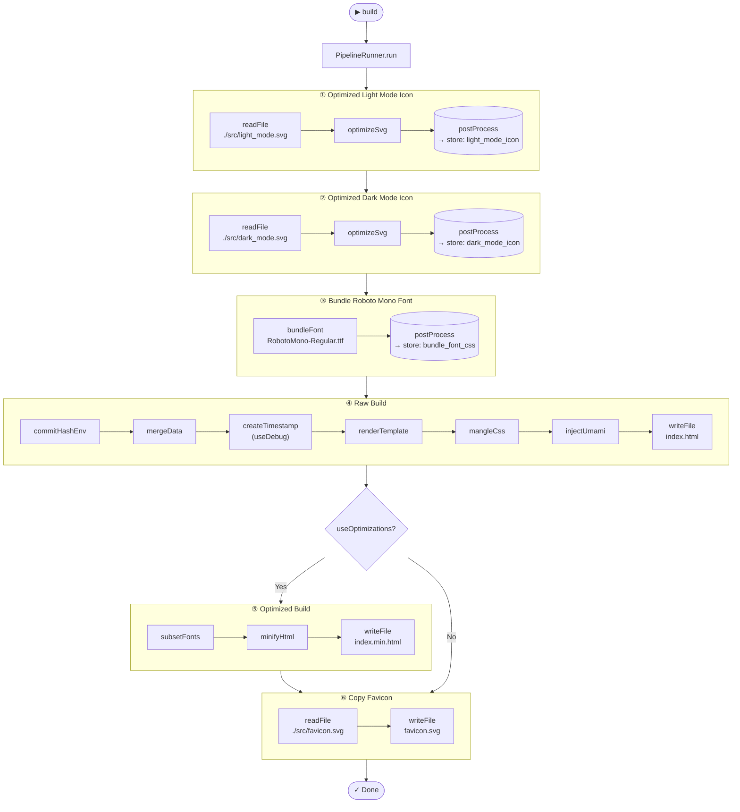

# Deno SSG

A lightweight, custom static site generator built with Deno. This pipeline
compiles, minifies, and bundles Vento templates, Fonts, CSS, and JS into a
single, self-contained HTML file deployed automatically via GitHub Actions.

[Live site](https://sethdegay.dev/) |
[Optimization report](https://sethdegay.dev/optimization-report.txt)

## Overview



## Workflow

### Prerequisites

- Docker for Dev Containers
- Visual Studio Code (with the `ms-vscode-remote.remote-containers` extension)

### Tasks Breakdown

| Task       | Command                                                                                                                                         | Description                                                                                                                 |
| ---------- | ----------------------------------------------------------------------------------------------------------------------------------------------- | --------------------------------------------------------------------------------------------------------------------------- |
| `build`    | `deno -P=build-permissions scripts/build.ts`                                                                                                    | Builds the project. Relevant environment variables should be provided.                                                      |
| `⭐ check` | `deno fmt && deno lint && deno task test`                                                                                                       | Executes linting, code formatting, and a full pipeline verification.                                                        |
| `clean`    | `rm -rf dist/ .tmp/`                                                                                                                            | Cleans up the workspace by deleting build artifacts and temporary files.                                                    |
| `⭐ dev`   | `COMMIT_HASH=$(git rev-parse origin/main) deno --watch=src/,data/ -P=build-permissions scripts/build.ts & deno -P=dev-permissions serve-dev.ts` | Starts a local development server and automatically rebuilds when changes are made.                                         |
| `ship`     | `git rev-parse --verify --quiet "$COMMIT_HASH^{commit}" && deno task build`                                                                     | Verifies that a valid Git commit hash exists before triggering the `build` task for deployment. This is intended for CI/CD. |
| `test`     | `deno test -P=test-permissions tests/`                                                                                                          | Runs the test suite in the `tests/` directory with test permissions.                                                        |

### Environment Variables

| Environment Variable | Allowed Values / Format       | Description                                                                                                                 |
| -------------------- | ----------------------------- | --------------------------------------------------------------------------------------------------------------------------- |
| **`COMMIT_HASH`**    | `/^[0-9a-f]{40,64}$/i`        | A SHA-1 or SHA-256 hash verified as a valid Git commit during deployment.                                                   |
| **`GITHUB_ACTIONS`** | `true` or `false`             | Used to detect if running in a GitHub CI/CD runner; also, controls whether to generate optimized deployment builds locally. |
| **`OUTPUT_DIR`**     | Filepath (Default: `./dist/`) | Determines the target directory where the build artifacts are saved.                                                        |

### Project Structure

| Directory      | Purpose                                                                                                                                                                |
| -------------- | ---------------------------------------------------------------------------------------------------------------------------------------------------------------------- |
| **`src/`**     | The source code for the frontend, containing Vento templates (`.vto`), raw CSS, client-side JS scripts, and asset files like fonts and SVGs.                           |
| **`plugins/`** | Custom build-step plugins that handle asset optimization (minifying, mangling, bundling), data merging, and injecting deployment metadata (timestamps, commit hashes). |
| **`scripts/`** | The orchestration layer for the build process, including configurations, core runners, and TypeScript type definitions.                                                |
| **`utils/`**   | Shared utility functions for handling environment variables, file system operations, hashing, logging, and time manipulation.                                          |
| **`tests/`**   | The test suite containing logic to validate the build pipeline, asset injection, and code mangling.                                                                    |
| **`data/`**    | Local data files (like `userdata.json`) that feed content into templates during the build process.                                                                     |
| **`dist/`**    | The production-ready output directory containing the compiled, minified, and optimized assets (`OUTPUT_DIR`).                                                          |

### Key Root Files

| File                     | Purpose                                                                                |
| ------------------------ | -------------------------------------------------------------------------------------- |
| **`serve-dev.ts`**       | The local development server script, executed during the `deno task dev` workflow.     |
| **`deno.jsonc`**         | The Deno configuration file defining tasks, permissions, and dependencies.             |
| **`deno.lock`**          | The lockfile ensuring strict module version locking and security across environments.  |
| **`generate-report.sh`** | A standalone shell script, used to generate optimization reports.                      |
| **`CNAME`**              | A configuration file used by GitHub Pages to map a custom domain to the deployed site. |

### User Data Configuration

To keep sensitive personal details out of the Git history, user data is managed
locally via JSON and deployed via GitHub Secrets. A sample structure is
available at [data/userdata.json](data/userdata.json) to demonstrate the
expected schema.

#### Deployment

1. Encode production `userdata.json` file to Base64 (without line wraps):

```bash
base64 -w 0 data/userdata.json
```

2. Navigate to repository: Settings > Secrets and variables > Actions > Secrets.
3. Create a new repository secret:

- Name: `USER_DATA`
- Value: [Paste the Base64 output here]

For implementation details, review the deployment logic in the
[workflow](.github/workflows/main.yml) file.

## Benchmark Target

The project aims for a 14KB budget, inspired by the idea that keeping a page
under 14KB allows it to load faster by fitting into a server's initial
congestion window (`initcwnd`). While actual server configurations and
`initcwnd` sizes vary, adopting this value established a clear guide for the
entire pipeline. _(Reference:
[Why your website should be under 14KB in size](https://endtimes.dev/why-your-website-should-be-under-14kb-in-size/))_
